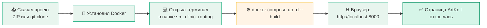
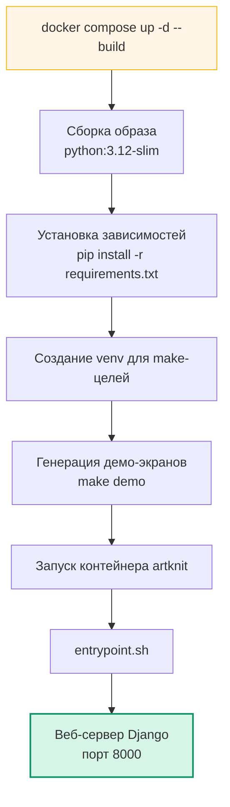
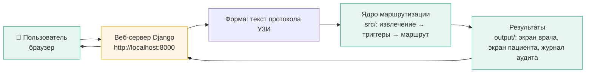
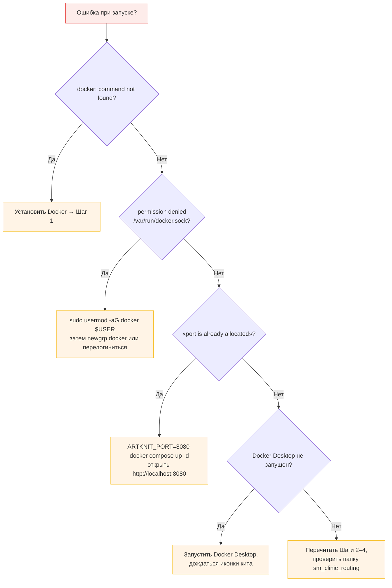
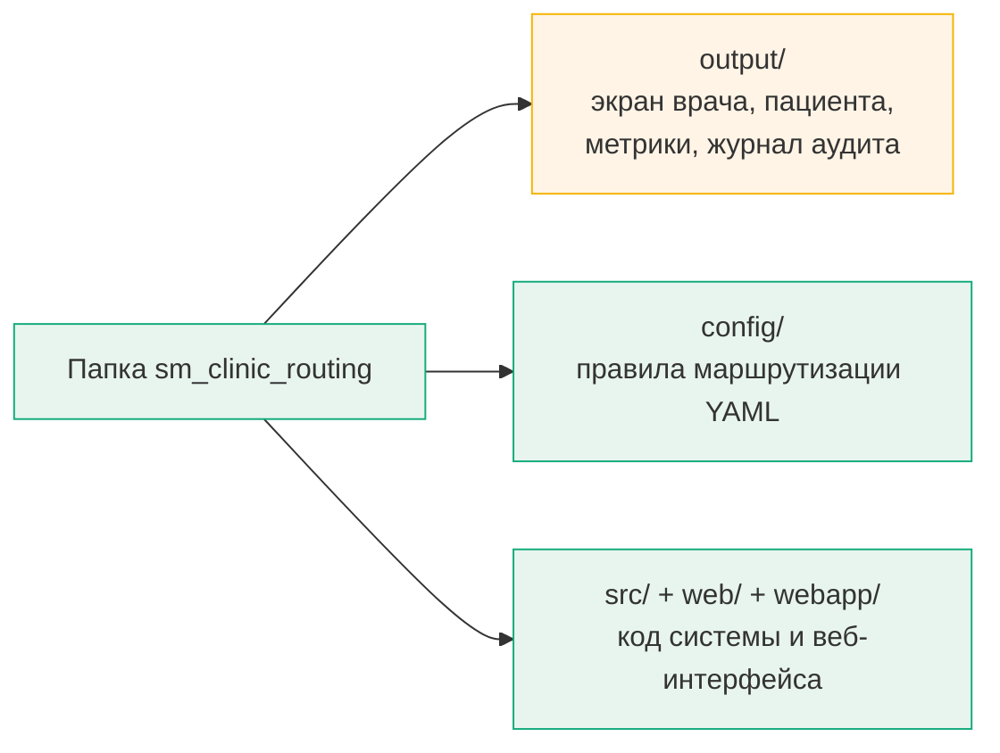

# 🚀 ArtKnit — как запустить на любом компьютере (подробная инструкция)

> Второй README проекта: пошаговое руководство «для начинающих» с картинками-схемами.
> Подходит для **Windows, macOS и Linux**. Команды везде одинаковые — просто копируйте и вставляйте.
>
> 📌 Основной README с описанием проекта: [`README.md`](README.md)
> 📌 Краткая справка по Docker: [`DOCKER.md`](DOCKER.md)

---

## 🧭 Карта пути (схема 1): от скачивания до открытого сайта



**Три простых шага:**
1. **Скачать** проект (кнопка `Code → Download ZIP`, распаковать).
2. **Установить** бесплатную программу Docker (один раз).
3. **Запустить** две команды и открыть браузер.

---

## 🧰 Что понадобится

| Что | Зачем |
|---|---|
| Компьютер | Windows 10/11, macOS или Linux — любой |
| Программа **Docker** | Собирает и запускает проект в изолированной «коробке» |
| **Интернет** | Только в первый раз — Docker скачает нужные компоненты |

Ничего другого устанавливать не нужно: Python, базы данных и все библиотеки Docker принесёт сам.

---

## ⚙️ Шаг 1. Установите Docker

### Windows
1. Откройте сайт: `https://www.docker.com/products/docker-desktop/`
2. Нажмите **Download for Windows**.
3. Запустите установщик: **Next → ОК → Install**.
4. Если попросит перезагрузиться — перезагрузитесь.
5. Запустите **Docker Desktop**. В трее (справа внизу) появится иконка кита 🐳. Когда она перестанет «мигать» — Docker готов.

### macOS
1. Тот же сайт → **Download for Mac**.
2. Перетащите Docker в папку «Программы».
3. Запустите **Docker Desktop**, дождитесь иконки кита вверху экрана.

### Linux (Ubuntu/Debian)
Откройте терминал и выполните по очереди:

```bash
sudo apt update
sudo apt install -y docker.io docker-compose-plugin
```

Разрешите себе пользоваться Docker без пароля (один раз):

```bash
sudo usermod -aG docker $USER
```

**Важно:** после этого выйдите из системы и войдите заново (или перезагрузитесь) — иначе права не применятся.

### ✅ Проверка для всех ОС

```bash
docker --version
```

- Видите `Docker version ...` → всё отлично, идём дальше.
- Видите `command not found` → вернитесь к установке.

---

## 💾 Шаг 2. Скачайте проект

1. Откройте страницу репозитория в GitHub.
2. Кнопка **Code** (зелёная, справа вверху) → **Download ZIP**.
3. Распакуйте архив (например, в «Загрузки» или «Документы»).

Внутри появится папка **sm_clinic_routing** — это и есть проект. Дальше мы работаем только с ней.

---

## 💻 Шаг 3. Откройте терминал в папке проекта

### Windows — самый простой способ
1. Откройте папку `sm_clinic_routing` в проводнике.
2. Кликните по **адресной строке** (строка сверху, где написано имя папки).
3. Сотрите текст, введите `cmd` и нажмите **Enter**.
4. Откроется чёрное окно терминала — оно уже «стоит» в правильной папке.

### macOS
1. Откройте папку `sm_clinic_routing` в Finder.
2. Правой кнопкой по папке → **Службы** → **Новый терминал в папке**.

### Linux
```bash
cd Путь/к/папке/sm_clinic_routing
```

**Как понять, что вы там:** в начале строки терминала написано `.../sm_clinic_routing`.

---

## 🚀 Шаг 4. Запустите сервер

Вставьте в терминал и нажмите **Enter**:

```bash
docker compose up -d --build
```

- **Первый раз** — 3–7 минут (Docker собирает «коробку»). Это нормально.
- **Все следующие разы** — несколько секунд.

Готово, когда увидите в конце:

```
✔ Container artknit  Started
```

### Что происходит в этот момент (схема 2)



---

## 🌐 Шаг 5. Откройте браузер

1. Откройте Chrome, Edge, Firefox или Safari.
2. В адресной строке (строка вверху) введите:

```
http://localhost:8000
```

3. Нажмите **Enter**.

Вы увидите страницу **«ArtKnit — Маршрутизация протоколов УЗИ»** с формой и боковым меню. 🎉

### Как устроена система (схема 3)



---

## 🧪 Шаг 6. Попробуйте (по желанию)

1. На главной странице найдите список **«Демо-протокол»**.
2. Выберите любой пункт, например *«Кардио (ГЛЖ + ФВ 45%)»* — текст сам подставится в форму.
3. Нажмите **«Обработать»**.
4. Появится маршрут: какой врач нужен, насколько срочно, в какой срок.
5. Нажмите **«Экран врача»** или **«Экран пациента»** — откроются готовые экраны.

---

## 🛑 Шаг 7. Остановите сервер

Когда закончите, вернитесь в терминал:

```bash
docker compose down
```

- Сервер остановится, страница перестанет открываться.
- Все результаты останутся в папке `output/` — ничего не потеряется.
- Для повторного запуска — снова Шаги 4–5 (теперь за секунды).

---

## 🆘 Если что-то не получается (схема 4: дерево решений)



### Таблица проблем

| Что вы видите | Причина | Решение |
|---|---|---|
| `docker: command not found` | Docker не установлен | Вернитесь к Шагу 1 |
| `permission denied ... /var/run/docker.sock` | Нет прав на Docker (Linux) | `sudo usermod -aG docker $USER`, затем `newgrp docker` или перелогиниться |
| «port is already allocated» | Порт 8000 занят другой программой | `ARTKNIT_PORT=8080 docker compose up -d`, открыть `http://localhost:8080` |
| Ошибка про WSL2 (Windows) | Не установлен бэкенд WSL2 | При установке Docker Desktop согласиться на WSL2, перезагрузить ПК |
| Сервер не стартует | Docker Desktop выключен | Запустить Docker Desktop, дождаться иконки кита 🐳, повторить запуск |
| Страница не открывается | Нужно проверить статус | `docker compose ps` — контейнер должен быть `Up` |

---

## 🧰 Шпаргалка команд

| Хочу… | Команда |
|---|---|
| Запустить сервер (если уже собирал) | `docker compose up -d` |
| Собрать и запустить с нуля | `docker compose up -d --build` |
| Проверить статус | `docker compose ps` |
| Посмотреть логи | `docker compose logs artknit` |
| Остановить сервер | `docker compose down` |
| Пересобрать «коробку» | `docker compose build` |
| Полный цикл проверки проекта | `docker compose run --rm artknit make all` |
| Прогнать тесты | `docker compose run --rm artknit make test` |
| Демо-генерация HTML | `docker compose run --rm artknit make demo` |
| Любая make-команда | `docker compose run --rm artknit make <имя>` |
| Открыть терминал внутри контейнера | `docker compose run --rm artknit bash` |

> 💡 **Совет:** команды `make` можно набирать и через обёртку:
> `make -f Makefile.docker all`  — работает точно так же.

---

## 📁 Что остаётся на компьютере



Все результаты генерации сохраняются в папке **`output/`** — она на вашем диске, поэтому после `docker compose down` данные остаются.

**Удачи! 🚀 Если сделали всё по шагам — сервер обязательно запустится.**